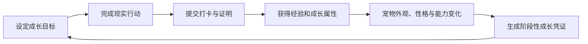

# 1260598954-ctrl

**GitHub ID:** 1260598954-ctrl

**Telegram:** 

## Self-introduction

Web3 暑期实习计划 - Monad Buidler Camp

## Notes

<!-- Content_START -->
# 2026-07-26
<!-- DAILY_CHECKIN_2026-07-26_START -->
产品定义：一款以桌面宠物为交互入口，将用户的真实成长转化为宠物状态、人格与链上履历的个人成长 DApp。

暂定名可以是 **Proof of Growth / 成长兽 / Habitling**。

**一、核心产品闭环**

````


桌面宠物不是装饰，而是用户成长状态的可视化反馈：

- 工作专注让宠物提升“专注”属性
- 阅读学习让宠物提升“智慧”属性
- 运动睡眠让宠物提升“活力”属性
- 创作输出让宠物提升“创造”属性
- 社交与公益让宠物提升“共情”属性

最终每只宠物的外观、动作、性格和记忆，都由用户长期行为共同决定。

**二、打卡不应只是签到**

产品需要区分不同可信度的行为，否则很容易退化为每日点按钮：

| 打卡类型 | 示例 | 验证方式 | 奖励权重 |
| --- | --- | --- | --- |
| 自我承诺 | 喝水、冥想 | 用户确认 | 低 |
| 设备行为 | 专注、运动、睡眠 | 系统或健康数据 | 中 |
| 内容成果 | 文章、代码、作品 | 链接或文件哈希 | 高 |
| 第三方证明 | 课程、比赛、志愿活动 | 平台或机构签发 | 高 |
| 同伴见证 | 结伴学习、线下活动 | 多人签名 | 中高 |

奖励公式可以综合：

`成长值 = 基础经验 × 连续性 × 验证强度 × 目标难度 × 新鲜度`

需要限制重复刷取。长期连续完成可以提高稳定性奖励，但中断不应让用户损失已有成果，也不要用宠物“死亡”惩罚用户。

**三、宠物成长系统**

宠物建议包含四层状态：

1. **基础状态**
    
    心情、精力、亲密度、饱腹感，主要服务日常互动。
    
2. **成长属性**
    
    智慧、活力、专注、创造、共情，来自不同类型的现实行动。
    
3. **人格特征**
    
    根据长期行为形成，例如“晨型探索者”“稳定创作者”“耐力型学习者”。人格应逐渐形成，而不是让用户直接选择。
    
4. **成长形态**
    
    宠物不是按统一等级进化，而是根据属性组合产生不同形态。连续学习和间歇学习，即使总经验相同，也可以形成不同外观和动作。
    

互动包括抚摸、喂食、玩耍、训练、对话、散步和拜访好友。互动消耗或恢复状态，但不直接替代现实成长。

**四、Web3 真正应该负责什么**

建议采用“链下高频使用，链上低频确权”的结构。

链下保存：

- 每日打卡明细
- 宠物实时状态
- 私密笔记与图片
- 高频互动记录
- 临时经验计算

链上保存：

- 宠物所有权
- 成长阶段与关键里程碑
- 记录内容的摘要哈希
- 第三方签发的成长凭证
- 宠物进化结果和稀有成就
- 用户授权的公开成长档案

这样可以降低费用、保护隐私，也避免每次摸宠物都要签名。

宠物可以采用动态 NFT，但默认不建议开放交易。个人成长记录一旦变成可炒作资产，用户会为了价格而不是成长使用产品。更合适的设计是：

- 宠物身份不可随意转让，接近 Soulbound Token
- 外观配件可以是可交易 NFT
- 里程碑凭证不可转让
- 用户可以导出、迁移或授权自己的成长数据
- 成长证明只记录摘要，原始内容由用户控制

**五、隐私与身份设计**

成长记录天然敏感。产品应支持三个可见级别：

- 私密：只有用户自己可见
- 可验证：内容不公开，但可证明某项成就真实存在
- 公开：用户主动展示在个人主页

首次使用不应强迫用户理解钱包、助记词和 Gas。可以采用邮箱或社交账号登录，并自动创建智能账户；等用户真正需要迁移、交易或导出资产时，再逐步介绍钱包概念。

一句重要原则是：

> 链上证明“发生过”，而不是公开“具体发生了什么”。
> 

**六、用户体验**

桌面端常驻一个轻量宠物，主要交互尽量在几秒内完成：

- 点击宠物：查看状态和今日目标
- 拖拽宠物：移动位置
- 右键或快捷菜单：打卡、专注、喂食
- 完成专注：宠物产生即时动作反馈
- 每日结束：生成一张成长小结
- 每周结束：宠物讲述这一周形成的“记忆”
- 达到里程碑：用户选择是否生成链上凭证

完整的成长时间线、资产管理、社交和隐私设置可以放在主面板中，不需要全部塞进桌面宠物的小窗口。

**七、社交机制**

社交应围绕陪伴和共同成长，而不是排行榜：

- 用户可建立 7 天或 30 天成长契约
- 宠物可以拜访好友桌面
- 多人完成共同目标后生成团体纪念物
- 好友可以为某项成果提供见证
- 社区挑战可以由创作者或组织发布
- 比较连续性和完成率，但弱化总经验排名

避免全局排行榜，它容易鼓励刷取和制造焦虑。

**八、商业模式**

比较自然的收入来源包括：

- 宠物皮肤、动作、声音和桌面主题
- 高级数据分析与成长报告
- AI 宠物记忆和个性化对话订阅
- 联名宠物与品牌挑战
- 教育机构、健身平台或社区发行认证任务
- 链上纪念物铸造费用

第一阶段不要发平台代币。代币会提前引入投机、机器人、防作弊和监管问题。先验证用户是否愿意持续打卡、是否会对宠物产生情感连接，再考虑社区积分或治理机制。

**九、建议的 MVP**

首版只验证一个关键假设：

> 宠物的成长反馈，能否让用户比普通习惯工具更愿意持续行动？
> 

MVP 可以包含：

- Windows 或 macOS 桌面宠物
- 3 类习惯：学习、运动、专注
- 每日目标与简单打卡
- 5 项宠物成长属性
- 3 个成长阶段
- 基础喂食、抚摸和对话
- 本周成长时间线
- 无感创建智能账户
- 每 7 天生成一次链上成长摘要
- 一个不可转让的宠物身份凭证

暂时不做代币、开放市场、复杂社交、DAO 和大量 NFT 配件。

**十、需要重点观察的指标**

- 次日、7 日、30 日留存
- 每周有效打卡天数
- 用户完成行为后与宠物互动的比例
- 第一次宠物进化的到达率
- 用户是否愿意保留并回看成长时间线
- 中断数日后的回归率
- 愿意生成链上里程碑的用户比例

产品的北极星指标可以定义为：

> 每周完成至少 3 次有效成长行为的活跃用户数。
> 
```
<!-- DAILY_CHECKIN_2026-07-26_END -->

# 2026-07-25
<!-- DAILY_CHECKIN_2026-07-25_START -->

[https://www.notion.so/Agent-39bd956e542c80268edcc393b5657436?source=copy\_link](https://www.notion.so/Agent-39bd956e542c80268edcc393b5657436?source=copy_link)
<!-- DAILY_CHECKIN_2026-07-25_END -->

# 2026-07-24
<!-- DAILY_CHECKIN_2026-07-24_START -->


### Agent支付安全

AI——Agent：从自动化到自主化，无法审计的自主性带来了agent安全攻防问题。

<aside>  
💡

Agent Guard：面向Agent系统的端到端安全平台，保护整个Agent系统。

</aside>

安全问题：过度授权、恶意skills、prompt注入、恶意安装包、AI幻觉——最小权限原则，定期排查；设置安全基线，敏感操作复核；部署安全工具。

解决方式：实时动态安全防护，恶意skiis扫描、安全体检（配置、环境、组件评估）、全球威胁情报。


<!-- DAILY_CHECKIN_2026-07-24_END -->

# 2026-07-23
<!-- DAILY_CHECKIN_2026-07-23_START -->


<!-- DAILY_CHECKIN_2026-07-23_END -->

# 2026-07-22
<!-- DAILY_CHECKIN_2026-07-22_START -->


<!-- DAILY_CHECKIN_2026-07-22_END -->

# 2026-07-21
<!-- DAILY_CHECKIN_2026-07-21_START -->


<!-- DAILY_CHECKIN_2026-07-21_END -->

# 2026-07-20
<!-- DAILY_CHECKIN_2026-07-20_START -->


W2文档：

[https://www.notion.so/39cd956e542c80d491cfec41500decaf?source=copy\_link](https://www.notion.so/39cd956e542c80d491cfec41500decaf?source=copy_link)
<!-- DAILY_CHECKIN_2026-07-20_END -->

# 2026-07-19
<!-- DAILY_CHECKIN_2026-07-19_START -->


# 运营流程

<aside>  
💡

产品、社区、生态等曝光与存续

</aside>

### 明确目标（从大到小细化）

1.  愿景与使命：
    
    围绕核心的价值观设定活动，确保行动符合（品牌）需求，并通过活动传播
    
    达成合作各方的共识，prepare for为细化目标
    
2.  核心目标（KPI）：e.g.可持续增长的web3开发生态
    
3.  用户群、builder画像：明确对接需求
    
4.  具体成功指标
    

### BD&合作伙伴

1.  商业向：赞助商、资源置换&联合用户
    
2.  传播向：合作社区、KOL、媒体、行业伙伴
    
3.  研究向：高校、研究机构
    

### Marketing&宣发

1.  内容策划&品牌包装：活动内容的细化，宣传计划等系列内容的准备
    
2.  社交媒体、社区推广、KOL：内容发布、合作策划
    
3.  媒体报道&活动预热：接收反馈，调整预案
    
4.  多通道触达目标用户：核心目标
    

### Program设计与规划

设计学习与实践路径：共学计划（学习内容、资料汇总、进度安排、教学计划、目标体系）、workshop/AMA、Hackathon、University Tour、Demo Day……

### Builder招募

报名表单设计/筛选机制——多通道招募——社群引导&入群转化——明确参与方式与激励机制

### Builder社区运营

TG/Wechat、社区建设、信息同步&内容沉淀、Office Hour、关系维护、FAQ

### 项目提交

明确各方向的提交内容与形式、收集存档

### 评审与反馈

评审机制、打分反馈、资源对接、评选公示

### 孵化与生态增长

1.  平台向：资金支持、资源对接
    
2.  用户向：实习机会、导师辅导
    
3.  合作方：人才筛选、生态共建
<!-- DAILY_CHECKIN_2026-07-19_END -->

# 2026-07-18
<!-- DAILY_CHECKIN_2026-07-18_START -->


# 运营流程

<aside>  
💡

产品、社区、生态等曝光与存续

</aside>

### 明确目标（从大到小细化）

1.  愿景与使命：
    
    围绕核心的价值观设定活动，确保行动符合（品牌）需求，并通过活动传播
    
    达成合作各方的共识，prepare for为细化目标
    
2.  核心目标（KPI）：e.g.可持续增长的web3开发生态
    
3.  用户群、builder画像：明确对接需求
    
4.  具体成功指标
    

### BD&合作伙伴

1.  商业向：赞助商、资源置换&联合用户
    
2.  传播向：合作社区、KOL、媒体、行业伙伴
    
3.  研究向：高校、研究机构
    

### Marketing&宣发

1.  内容策划&品牌包装：活动内容的细化，宣传计划等系列内容的准备
    
2.  社交媒体、社区推广、KOL：内容发布、合作策划
    
3.  媒体报道&活动预热：接收反馈，调整预案
    
4.  多通道触达目标用户：核心目标
    

### Program设计与规划

设计学习与实践路径：共学计划（学习内容、资料汇总、进度安排、教学计划、目标体系）、workshop/AMA、Hackathon、University Tour、Demo Day……

### Builder招募

报名表单设计/筛选机制——多通道招募——社群引导&入群转化——明确参与方式与激励机制

### Builder社区运营

TG/Wechat、社区建设、信息同步&内容沉淀、Office Hour、关系维护、FAQ

### 项目提交

明确各方向的提交内容与形式、收集存档

### 评审与反馈

评审机制、打分反馈、资源对接、评选公示

### 孵化与生态增长

1.  平台向：资金支持、资源对接
    
2.  用户向：实习机会、导师辅导
    
3.  合作方：人才筛选、生态共建
<!-- DAILY_CHECKIN_2026-07-18_END -->

# 2026-07-17
<!-- DAILY_CHECKIN_2026-07-17_START -->


# MOSS入门指南

### 了解Moss

为Monad区块链设计的AI Agent管家，将Monad上复杂的DApp/协议统一转化为可由Agent调用的能力。Moss能安全地完成四类日常操作——包装代币、转账代币、转账 NFT、在 Kuru 上交易，但不会做跨链或闪电贷这类高风险操作。Moss 会利用大语言模型理解用户的意图，并识别任务涉及的对象、目标和预期结果。整个交互过程更接近与助手对话，而不是传统的软件操作方式，因此即使没有编程经验的用户，也可以快速开始使用。

### 核心能力

1.  用户层面：通常让AI Agent在链上行动需要开发者手动处理大量底层技术细节（调用数据、ABI、合约地址），而Moss的主要目标就是降低技术门槛，让更多用户能够高效使用Agent。
    
2.  技术层面：AI Agent独立完成交易组装的能力仍然存疑，Moss通过Skills库的建立把各种能力打包，让Agent可以直接运行而非从0构建。
    
3.  安全层面：一方面通过模拟交易形成一个可能性并与预期进行逐项对比，形成报告；另一方面Moss服务器同样会进行预测结果与用户真实意图，不一致处触发警告并停止流程（不进入正式交易）。
    

### Moss的工作机制

**Moss 的安全分工逻辑**

传统认知中，将 AI 引入资产管理存在天然顾虑——AI 可能出错，也可能遭受外部攻击。一旦 AI 获得签名权限，资产便暴露于“不可控”的风险之下。Moss 的设计哲学，正是**从根本上假设 AI 不可完全信任**。为此，它采用了一套“三权分离”的架构，将链上操作中“构建交易、验证交易、签名交易”三个关键环节，分别交由三个独立且互不信任的角色执行，形成有效的权力制衡。


1.  **AI Agent —— 意图的传达者**
    

AI Agent在整个流程中扮演 “管家” 的角色。其核心职能是**理解用户以自然语言表达的意图**（例如“将 10 个 MON 兑换为 USDC”），并据此驱动 Moss 执行具体的技术操作。

AI 代理的权限被严格限定于 **“发起与监督”** 层面，不具备直接操作钱包或签名发送交易的能力。它是整个工作流的启动器，而非执行者。

1.  **Moss —— 方案的构建者与验证者**
    

Moss 承担 **“技术工程师兼质检员”** 的双重职能。

其一，**构建交易方案**。Moss 内部维护一个涵盖多种协议操作模板的资源库（如 Kuru 兑换、MON 包装等）。当接收到 AI 代理的指令后，Moss 调用对应模板，自动生成一笔完整的、**未签名的交易草案**，其中包含合约调用地址、资产数量、滑点容忍度等全部技术参数。用户无需理解 ABI 接口、无需进行小数位换算，所有底层细节均由 Moss 封装处理。

其二，**执行模拟验证**。交易草案生成后，Moss 不会直接交付用户签名，而是在一个基于当前链上真实状态的“沙盒”环境中进行模拟执行，以验证交易的实际效果。若模拟结果与预期存在任何偏差，Moss 将立即发出警告并中止流程。

**Moss 在任何环节均不触碰用户的私钥，亦不发送任何交易。** 其职责仅限“方案构建与质量核验”，不涉及“实际操作”。

1.  **钱包（用户）—— 最终决策者**
    

用户通过钱包扮演 **“最终决策者”** 的角色。私钥始终由用户独占保管，任何交易均须经用户亲自审查并签名后方可执行。当 Moss 完成模拟并确认无异常后，交易草案将被推送至用户钱包。此时用户拥有完全自主权：

-   **核验通过，签名发送**：交易提交至链上执行。
    
-   **存有疑虑，拒绝签名**：交易即时作废，资产状态不受任何影响。
    

Moss 的核心安全逻辑可以归纳为：让 AI 代劳技术性工作\*\*，\*\*确保其无法绕过用户执行任何链上操作，**将最关键的签名权保留于用户之手。**

Moss工作流程

完成 Moss 的安装后，即可开始使用。与传统命令行工具不同，Moss 采用的是 **Agent（智能代理）** 的工作模式。用户只需提出任务目标，Moss 会自动理解需求、规划执行步骤、调用相应工具完成任务，并将最终结果反馈给用户。

1.  Discover & Load：核心是搭建一个Skills库，汇集各种预先编写好的Skills，让Agent能够挑选、加载、调用。
    
2.  Action：发出Prompt，Moss自动理解并处理所有技术细节。
    
3.  Simulate & Verify：Moss进行交易推演并反馈，资产调用情况及后果。
    
4.  Build & Submit：双重安全检查通过后形成交易，等待用户最终确认。
    

<aside>  
💡

模拟是交易形成前必要的安全防护措施，但链上状态实时变化，模拟≠100%安全。

Moss可以接受连续的计划，按照规定顺序串联执行。

Moss仅支持在Monad上的交易模拟，跨链无法保证安全性。

</aside>

### 进阶能力

1.  **连环操作**：支持“先兑换、再存款”等多步骤级联模拟
    

Moss 支持将多个操作按顺序组合成一个完整的工作流，并在模拟环境中**按顺序依次执行**，前一步产生的资产可以直接被后一步使用。Moss 的 `simulate` 方法支持传入**一个有序的 Plan 列表**。在模拟时，系统会按照顺序依次执行每个 Plan，并且**将前一步产生的资产状态传递给后一步**——也就是说，第二步的模拟可以“借用”第一步虚拟产出的资产，就像它们已经真实存在一样。

这一机制被称为 **“状态级联”** 。它让 Moss 能够对整个工作流进行端到端的模拟验证，一次性向用户展示完整的效果报告：

-   第一步兑换产生多少 USDC？
    
-   第二步存款后，存款凭证（如 aUSDC）增加了多少？
    
-   整个流程中，Gas 费用总计多少？
    
-   是否有任何一步的资产变动超出了预期范围？
    

1.  **零成本测试：**一键克隆主网，在真实市场环境下安全试用
    

区块链操作的一大痛点在于：**你无法在不付出实际成本的前提下，测试一笔交易是否能够成功执行。** 在以太坊或 Monad 主网上，任何写入操作都需要支付 Gas 费用，且交易一旦上链便不可撤销。这意味着用户在进行不熟悉的操作时，往往面临两难：

-   直接操作，担心出错丢钱；
    
-   想先试试，却没有“模拟环境”可用。
    

Moss 提供了一种更彻底的解决方案：**一键克隆（Fork）Monad 主网到本地环境，并在克隆后的网络中执行完整测试。Moss 利用 Monad 节点的** `debug_traceCall` **接口，可以在本地构建一个与主网状态完全一致的分叉网络**。在这个分叉中：

-   所有账户余额、代币持有量、合约状态均与主网实时同步；
    
-   所有 DeFi 协议（如 Kuru DEX）的订单簿、流动性池状态均为真实数据；
    
-   用户可以任意分配测试资金到自己的虚拟钱包中；
    
-   所有操作均在本地执行，**不产生真实 Gas 费用，不影响主网状态**。
<!-- DAILY_CHECKIN_2026-07-17_END -->

# 2026-07-16
<!-- DAILY_CHECKIN_2026-07-16_START -->


# 认识Moss

### 项目简介

为Monad区块链设计的AI Agent管家，将Monad上复杂的DApp/协议统一转化为可由Agent调用的能力。Moss能安全地完成四类日常操作——包装代币、转账代币、转账 NFT、在 Kuru 上交易，但不会做跨链或闪电贷这类高风险操作。

### 核心问题

1.  用户层面：通常让AI Agent在链上行动需要开发者手动处理大量底层技术细节（调用数据、ABI、合约地址），而Moss的主要目标就是降低技术门槛，让更多用户能够高效使用Agent。
    
2.  技术层面：AI Agent独立完成交易组装的能力仍然存疑，Moss通过Skills库的建立把各种能力打包，让Agent可以直接运行而非从0构建。
    
3.  安全层面：一方面通过模拟交易形成一个可能性并与预期进行逐项对比，形成报告；另一方面Moss服务器同样会进行预测结果与用户真实意图，不一致处触发警告并停止流程（不进入正式交易）。
    

### 核心能力

1.  Discover & Load：核心是搭建一个Skills库，汇集各种预先编写好的Skills，让Agent能够挑选、加载、调用。
    
2.  Action：发出Prompt，Moss自动理解并处理所有技术细节。
    
3.  Simulate & Verify：Moss进行交易推演并反馈，资产调用情况及后果。
    
4.  Build & Submit：双重安全检查通过后形成交易，等待用户最终确认。
    

<aside>  
💡

模拟是交易形成前必要的安全防护措施，但链上状态实时变化，模拟≠100%安全。

Moss可以接受连续的计划，按照规定顺序串联执行。

Moss仅支持在Monad上的交易模拟，跨链无法保证安全性。

</aside>

### 可能应用场景

Moss 最优先会被选用的场景是 “AI Agent驱动的 DeFi 自动化操作”。这个场景选择了 Moss，是因为它把 “链上操作的复杂性”封装成了一个 AI 代理可调用的标准化工具箱，并通过“模拟 + 双重验证 + 不碰私钥”的安全设计，让非技术用户敢于放心地让 AI Agent替自己管理资产，最终服务于 “将 Monad 的高性能转化为普通用户可感知的低门槛、高安全、自动化的链上体验” 这一目标。
<!-- DAILY_CHECKIN_2026-07-16_END -->

# 2026-07-15
<!-- DAILY_CHECKIN_2026-07-15_START -->


<!-- DAILY_CHECKIN_2026-07-15_END -->

# 2026-07-14
<!-- DAILY_CHECKIN_2026-07-14_START -->


### 智能钱包和安全助手

-   逻辑：普通用户怎么安全使用web3，从单私钥账户升级到智能账户、交易模拟、权限管理、恶意DApp检测和签名前提醒。
    
-   痛点：用户看不懂签名后果。
    
-   方式：智能钱包把账户变成权限系统、多签、回复、限额、Session key、gas sponstor。把签名确认变成交易解释+风险拦截。
<!-- DAILY_CHECKIN_2026-07-14_END -->

# 2026-07-13
<!-- DAILY_CHECKIN_2026-07-13_START -->


### 智能钱包和安全助手

-   逻辑：普通用户怎么安全使用web3，从单私钥账户升级到智能账户、交易模拟、权限管理、恶意DApp检测和签名前提醒。
    
-   痛点：用户看不懂签名后果。
    
-   方式：智能钱包把账户变成权限系统、多签、回复、限额、Session key、gas sponstor。把签名确认变成交易解释+风险拦截。
    

### Agent支付安全

AI——Agent：从自动化到自主化，无法审计的自主性带来了agent安全攻防问题。

<aside>  
💡

Agent Guard：面向Agent系统的端到端安全平台，保护整个Agent系统。

</aside>

安全问题：过度授权、恶意skills、prompt注入、恶意安装包、AI幻觉——最小权限原则，定期排查；设置安全基线，敏感操作复核；部署安全工具。

解决方式：实时动态安全防护，恶意skiis扫描、安全体检（配置、环境、组件评估）、全球威胁情报。


<!-- DAILY_CHECKIN_2026-07-13_END -->

# 2026-07-12
<!-- DAILY_CHECKIN_2026-07-12_START -->


# AI如何拥有支付能力

AI-native payment infrastructure built for the agent economy.

核心问题：不具备身份属性的agent在处理支付场景时的同时，保护用户的信息，防止金融风险。

约束、风控、高效

形式：ATA, ATMerchant, ATTool,

运行过程：

agent prompt——AI wallet (identity, budget, policy, audit, revocation)——others (agent card, agent charge, monetize, ODP/AEP2)

<aside>  
💡

Co-wallet: human sets rules, agent operates

目前card更多为单次使用，实现目标后失效，for safe.

monetize: 为skill，API等付费，for OPCs, 资源集合平台，集中调用。

</aside>

实现逻辑：行动开始前通过合约授权，明确行动框架后agnet自动执行。
<!-- DAILY_CHECKIN_2026-07-12_END -->

# 2026-07-11
<!-- DAILY_CHECKIN_2026-07-11_START -->


### AI Agent+钱包

-   逻辑：AI从建议者变成行动者，Agent需要身份、钱包、限额、付款、交易执行和撤销权限。
    
-   方式：人类授权范围内自动执行。
    
-   关键guardrails：预算、白名单、单笔上限、会话上线、KYT、日志和撤销。
    
-   Web3应用场景：量化操作、合约监控、发交易。
    
-   E.G. Coinbase AgentKit
    
    AI Agent在授权范围内完成转账、Swap、合约调用和部署等真实链上动作。
    
    原理：用户输出目标、LLM拆解任务、AgentKit选择链上行动、Wallet Provider签名和广播、链上结果返回Agent。
<!-- DAILY_CHECKIN_2026-07-11_END -->

# 2026-07-10
<!-- DAILY_CHECKIN_2026-07-10_START -->


### 去中心化AI基础设施

-   逻辑：解决AI生产要素怎么被组织：GPU、存储、数据集、模型推理、Agent服务市场以及这些服务如何用token激励和验证。
    
-   方式：链下计算、链上激励、结算、验证和服务发现。
    
    调用Agent的行动（Agent训练及相应算力的消耗）在区块链以外执行，其服务内容与质量由Validator打分并在链上进行记录公示，以此作为激励代币的分发依据。
    
-   难点：质量验证、反作弊、稳定性、价格效率和企业级SLA。
    
-   中心化云通常是平台化资源市场：Bittensonr、Render、Akash代表更开放的资源市场实验。
    
-   E.G. Bittensor
    
    用市场机制组织AI服务，把模型输出、推理服务、数据服务或预测能力放进不同subnet竞争，再通过验证者评分和token激励分配收益。原理为：subnet定义任务和评分规则，Miner提供AI服务，Validator评估输出质量、链上共识汇总评分、优质供给获得奖励。
<!-- DAILY_CHECKIN_2026-07-10_END -->

# 2026-07-09
<!-- DAILY_CHECKIN_2026-07-09_START -->


### 比特币（区块链1.0：注重货币属性）

1.  定义：点对点的电子现金系统&人类完全自主控制的数字资产（无三方介入）。
    
2.  特性：总量有限+自由交易=加密货币。由于比特币以区块链为底层技术，账户匿名、交易公开透明、不可篡改、完全在虚拟网络中，使得比特币相比跨境转账结算等场景要方便许多，从而具备使用价值。
    

### 以太坊 Ethereum（区块链2.0：扩大区块链技术的应用场景）

-   以太坊在比特币基础上建立了名为智能合约的开源程序，是建立在区块链技术上的去中心化应用平台，原生货币为Ether。任何能够连接互联网的人都可以使用智能合约，这一特性使得以太坊网络成为了一个全球数字基础设施。
    
-   web3：数字资产+去中心化金融+艺术和收藏品+游戏+去中心化社交媒体。
    
-   Gas Fee: 链上操作需支付给网络服务提供商的手续费。
    
-   特性/优势：
    
    抗审查：交易透明。
    
    安全：个人掌管数字资产，代码即法律（智能合约）。
    
    可靠：运行稳定。
<!-- DAILY_CHECKIN_2026-07-09_END -->

# 2026-07-08
<!-- DAILY_CHECKIN_2026-07-08_START -->


智能合约通常涉及可信第三方，例如参与履行的中间人，以及被调用以解决因履行（或未履行）而产生的争议的仲裁者。合同相对性意味着我们希望尽量减少对第三方的脆弱性。可验证性和观察性往往要求我们调用这些第三方。中间人必须被信任以接触合约的部分内容和/或履行过程。仲裁者必须被信任以接触部分内容、部分履行历史，并公正地解决争议和施加处罚。在智能合约设计中，我们希望最大限度地利用中间人和仲裁者，同时最大限度地减少对他们的暴露。一种常见的做法是，仅在发生争议时才违反保密性。

### 智能合约 Smart Contracts

-   智能合约是一组以数字形式规定的承诺，包括各方履行这些承诺所依据的协议。是以太坊应用层的基础构建块，遵循if逻辑，一旦创建无法更改。
    
-   基本逻辑：许多类型的合同条款（如留置权、担保、财产权的界定等）可以被嵌入到我们所用的硬件和软件中，使得违约对违约方而言代价高昂。
    
-   总体目标满：足常见的合约条件（如支付条款、留置权、保密性，甚至强制执行），最大限度地减少恶意和意外异常情况，并最大限度地减少对可信中介的需求。相关的经济目标包括降低欺诈损失、仲裁与执行成本以及其他交易成本。
    
-   智能合约有一项重要任务是向交易相关方传达交易的语义信息，可利用多方安全计算、盲签名、不经意传输等密码学协议，实现信息的选择性披露——即部分信息对部分参与方隐藏，这正是隐藏条款的技术基础。
    
-   安全形式：
    
    -   被动式安全：由司法系统决定执行机构针对违约行为采取何种物理措施。
        
    -   主动式安全：使违约代价高昂的物理机制。
        
-   合约设计基本目标：
    
    -   观察性\*\*：\*\*当事人相互观察对方履约情况的能力，或向其他当事人证明自己履约情况的能力。
        
    -   可验证性：当事人向仲裁者证明合同已被履行或已被违反的能力，或者仲裁者通过其他方式查明这一事实的能力。
        
    -   合同相对性（privity）：关于合同内容与履行的知情权和控制权，应当在各方之间仅按履行该合同所必需的程度进行分配。普通法上合同相对性原则的推广规定，除指定的仲裁者和中介人外，第三方对合同的执行不应有发言权，即保护有关合同、缔约方及其履行的信息价值免受窃听者、攻击者侵害，被归入合同相对性范畴，财产权亦同。
        
    -   可执行性：最大限度地减少对强制执行的需求。可验证性的提高往往也有助于实现这第四个目标（履行能力与强制执行呈反比）。
        

  
💡

智能合约通常涉及可信第三方，例如参与履行的中间人，以及被调用以解决因履行（或未履行）而产生的争议的仲裁者。合同相对性意味着我们希望尽量减少对第三方的脆弱性。可验证性和观察性往往要求调用这些第三方。中间人必须被信任以接触合约的部分内容和/或履行过程。仲裁者必须被信任以接触部分内容、部分履行历史，并公正地解决争议和施加处罚。智能合约设计希望最大限度地利用中间人和仲裁者，同时最大限度地减少对他们的暴露。一种常见的做法是，仅在发生争议时才违反保密性。
<!-- DAILY_CHECKIN_2026-07-08_END -->

# 2026-07-07
<!-- DAILY_CHECKIN_2026-07-07_START -->


ps:交易实践&理解，
<!-- DAILY_CHECKIN_2026-07-07_END -->

# 2026-07-06
<!-- DAILY_CHECKIN_2026-07-06_START -->


### 区块链

1.  定义：去中心化的分布式账本底层技术，用以解决信任问题，实现多人同时记账。
    

  
💡

信任机器：不可篡改的特性，链上的历史信息无法改变，且多人同时记账使得某些改动不会被认可。

数据互通：链上信息公开透明，交易可追溯，数据伴随区块链网络一直存在。

改进生产关系：交易记录打包到区块中，交易自动完成。P2P。

1.  运行：
    
    交易=账本改变，交易产生后向全网广播。
    
    区块=账单，记录一段时间内所有的交易和状态结果。
    
    区块链=账本，将账单按照时间顺序连接并更新。
    

  
💡

交易构成

付款人：A

收款人：B

数量：X

来源：A的余额

A的数字签名

交易——广播——**验证**——**出块**——成链——激励

验证：矿工验证上页和本页hash，交易余额（合法性）。

出块：通过共识机制（Pow/PoS），将交易打包成区块。  
💡

1.  挖矿：维持网络运行or竞争记账权以获得代币激励。（e.g. 哈希函数解密）
    
2.  区块构成
    

块头：头hash，父hash——映射时间关系

块体：交易1、2、3……时间戳

1.  双重支付：遵循最长链原则
    
    双重支付——链分叉——其他记账者继续工作，对区块链的选择导致链长出现区别——承认最长链有效
    
    共识：等待6个区块做最终确认。
    

1.  分类：
    
    **公链：**任何人都可以读取、发送交易；任何人都能够参与共读过程，采取PoW/PoS机制，将奖励和数字验证结合。但人数太多带来决策效率和维护成本问题。
    
    **联盟链：**准入制，数据半公开，共识在成员内部达成，无奖励代币。灵活性下降。
    
    **私有链：**准入权力由一个组织掌握。中心化。
    

### 比特币

1.  定义：点对点的电子现金系统&人类完全自主控制的数字资产（无三方介入）。
    
2.  特性：总量有限+自由交易=加密货币。由于比特币以区块链为底层技术，账户匿名、交易公开透明、不可篡改、完全在虚拟网络中，使得比特币相比跨境转账结算等场景要方便许多，从而具备使用价值。
<!-- DAILY_CHECKIN_2026-07-06_END -->
<!-- Content_END -->
