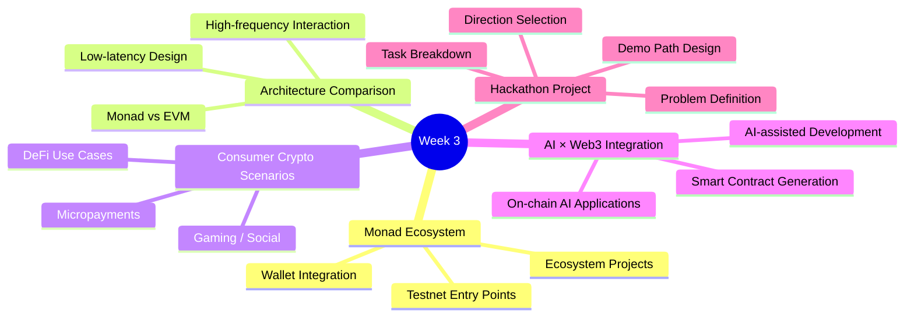
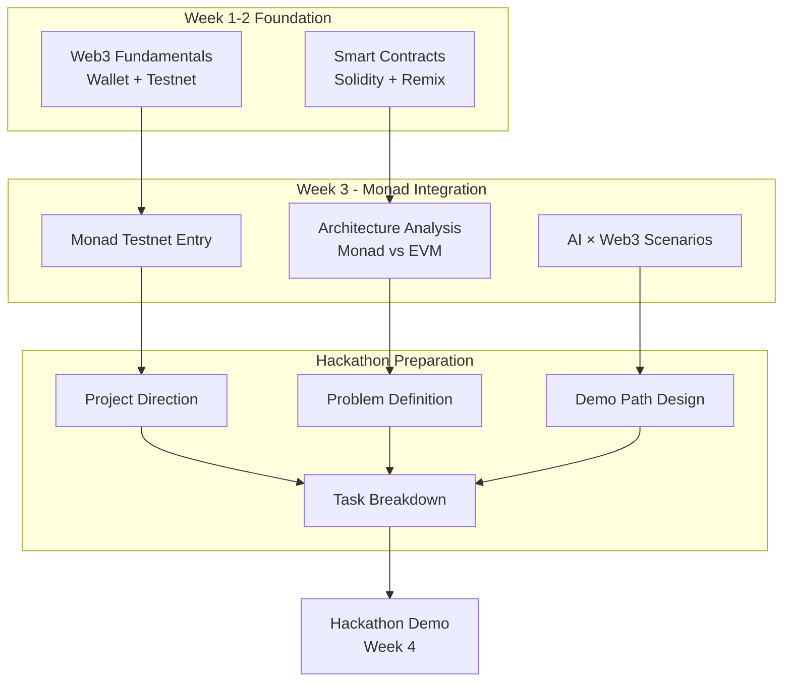
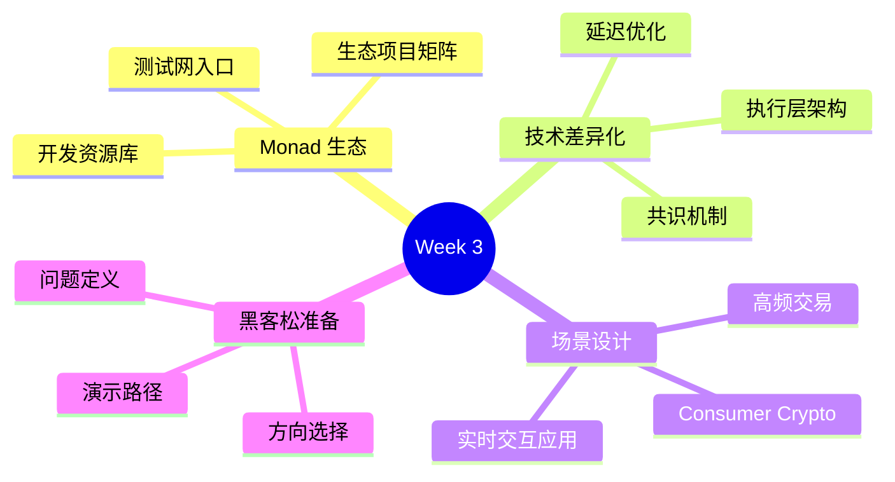
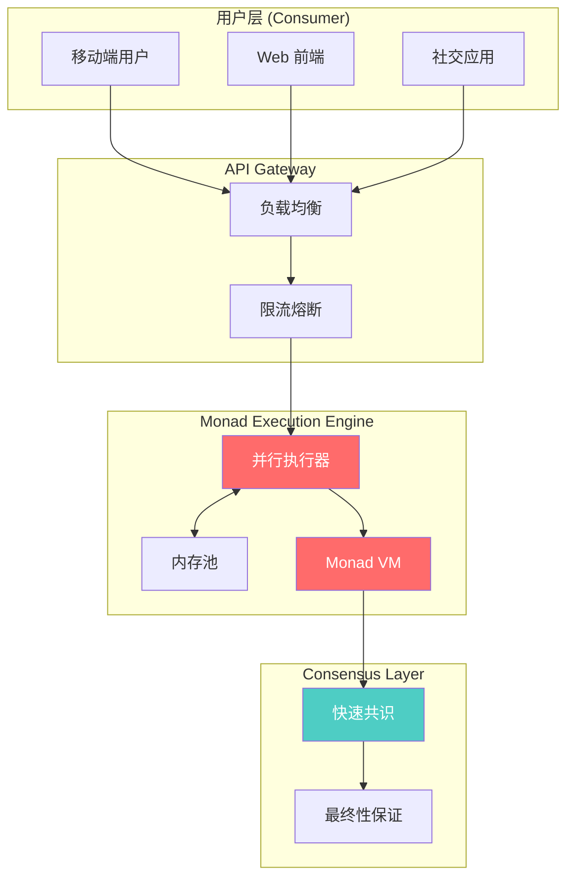
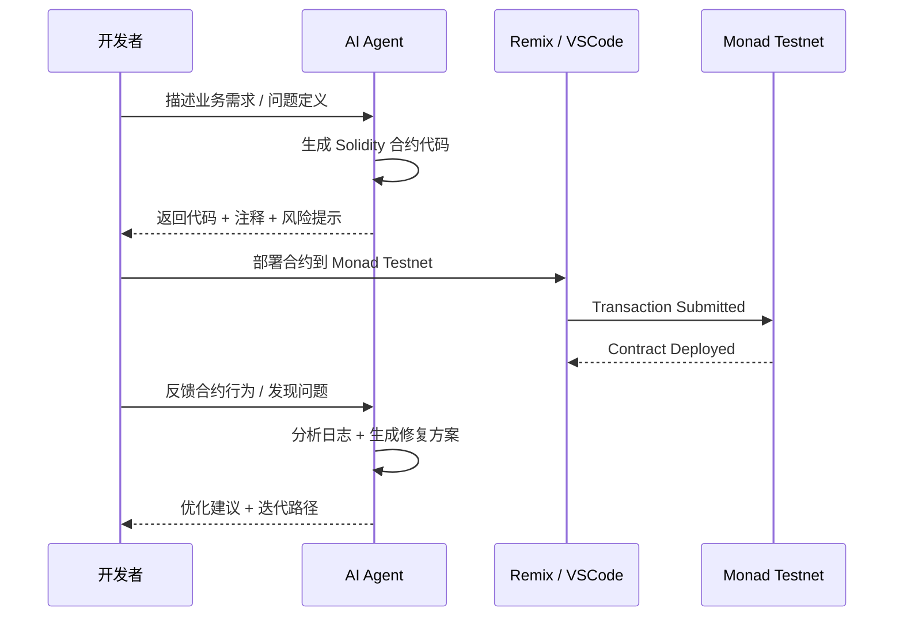
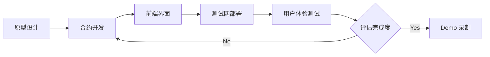
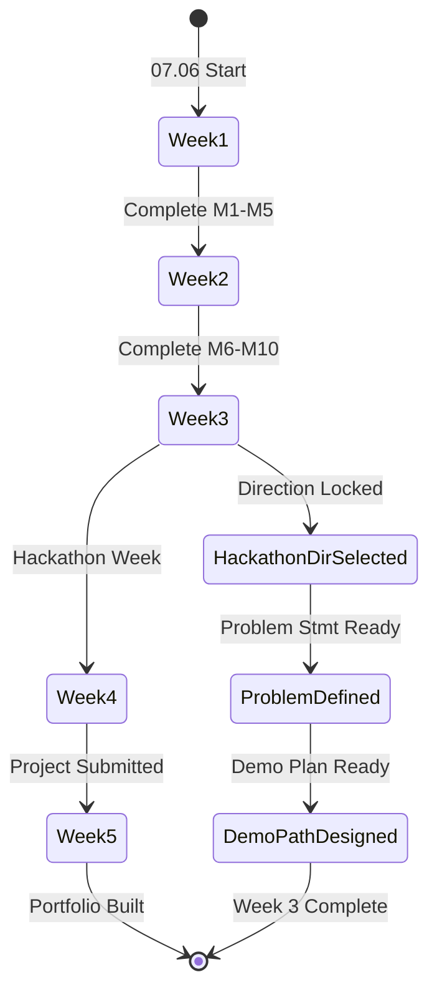

# ⠀Bein⠀

**GitHub ID:** Minami-Bein

**Telegram:** 

## Self-introduction

Web3 暑期实习计划 - Monad Buidler Camp

## Notes

# 2026-08-28
<!-- DAILY_CHECKIN_2026-08-28_START -->
打卡内容1
<!-- DAILY_CHECKIN_2026-08-28_END -->

# 2026-07-28
<!-- DAILY_CHECKIN_2026-07-28_START -->
打卡内容1
<!-- DAILY_CHECKIN_2026-07-28_END -->

# 2026-07-27
<!-- DAILY_CHECKIN_2026-07-27_START -->
1
<!-- DAILY_CHECKIN_2026-07-27_END -->

# 2026-07-26
<!-- DAILY_CHECKIN_2026-07-26_START -->
# Day 21 学习打卡报告

## Web3 Internship Program - Monad Builder Camp
**共学周期**：2026.07.06 - 2026.08.07 | **Week 3：Monad Practice & Project Direction**

---

## 🔍 目录

- [执行摘要](#1-executive-summary--problem-space)
- [系统架构与拓扑](#2-系统架构与拓扑)
- [理论框架与形式分类](#3-理论框架与形式分类)
- [状态机与协议演练](#4-状态机与协议演练)
- [Week 3 核心产出](#5-week-3-核心产出)
- [漏洞向量与边界验证](#6-漏洞向量与边界验证)
- [学术标签](#7-学术标签)

---

## 1. Executive Summary & Problem Space

### 摘要（Abstract）

| 维度 | 内容 |
|------|------|
| **日期** | 2026-07-26（Day 21 / Week 3 收官日） |
| **学习阶段** | Week 3：Monad Practice & Project Direction |
| **核心任务** | 将前两周所学 Web3 基础知识与智能合约实践迁移至 Monad 生态，完成 Hackathon 项目方向立项 |
| **技术挑战** | 理解 Monad 与传统 EVM 链的架构差异、高频交互与低延迟特性在消费级加密场景中的应用 |
| **预期贡献** | 确定 Hackathon Track、输出 Problem Definition、规划 Initial Demo Path |

### In-Scope / Out-of-Scope

| In-Scope | Out-of-Scope |
|----------|--------------|
| Monad Testnet 生态入口探索 | Mainnet 主网部署 |
| Monad vs EVM 架构差异分析 | 生产级合约安全审计 |
| Hackathon 项目方向选择 | 完整 MVP 开发 |
| AI × Web3 应用场景设计 | 商业化落地规划 |

---

## 2. 系统架构与拓扑

### 概念脑图（Conceptual Mindmap）



### 组件拓扑图（Component Topology）



---

## 3. 理论框架与形式分类

### 核心术语表（Glossary）

| 术语 | 功能描述 | 输入类型 | 输出类型 | 约束条件 |
|------|----------|----------|----------|----------|
| **Monad Testnet** | Monad 生态测试网络，用于开发者在主网上线前进行实验 | Testnet Token / RPC Endpoint | Transaction Hash / Contract Address | 需配置正确 Chain ID |
| **High-frequency Interaction** | 高频链上交互模式，适用于 DeFi / Gaming 场景 | User Action Events | On-chain State Update | 受 Gas 成本 / TPS 限制 |
| **Low-latency Execution** | 低延迟交易执行，Monad 核心架构优势 | Signed Transaction | Confirmed Transaction | 需理解 Monad 共识机制 |
| **Consumer Crypto** | 面向普通消费者的加密应用，强调 UX / 门槛低 | User Intent | Simplified On-chain Interaction | 需抽象复杂性 |
| **AI-assisted Development** | 利用 AI 辅助智能合约开发、文档生成、代码审查 | Natural Language Prompt | Generated Code / Explanation | Human Review 必需 |

### 类型系统约束（Type System Constraints）

```latex
// Monad Transaction Type
type MonadTransaction = {
    from: Address,
    to: Address | ContractAddress,
    value: Wei,
    data: bytes,
    gasLimit: uint256,
    chainId: uint256  // Monad Mainnet: TBD, Testnet: 10143
}

// EVM Transaction Compatibility
// ∀ tx ∈ MonadTransaction: EVMCompatible(tx) = true
// Monad maintains EVM opcode compatibility with extended performance
```

### 系统不变量（System Invariants）

$$Invariant_1: \forall project \in HackathonProjects, hasProblemDefinition(project) = true$$
$$Invariant_2: \forall direction \in SelectedDirections, alignedWithMonadEcosystem(direction) = true$$
$$Invariant_3: Week3Completion = TaskBreakdown \cup DemoPathDesign \cup TrackSelection$$

---

## 4. 状态机与协议演练

### 时序图（Sequence Diagram）

```mermaid
sequenceDiagram
    participant Learner as 学习者 (Day 1-21)
    participant Docs as Monad 文档
    participant Testnet as Monad Testnet
    participant AI as AI Assistant
    participant Team as Hackathon 团队
    
    rect rgb(40, 60, 80)
        Note over Learner, Team: Week 3: Monad Practice & Project Direction
        
        Learner->>Docs: 探索 Monad 生态入口
        Docs-->>Learner: 返回 Entry Points 列表
        
        Learner->>Testnet: 连接钱包 + 获取 Testnet Token
        Testnet-->>Learner: Faucet Success
        
        Learner->>Docs: 分析 Monad vs EVM 差异
        Note right of Docs: 高频交互 / 低延迟 / <br/>消费级加密场景
        
        Learner->>AI: 询问 AI × Web3 应用方向
        AI-->>Learner: 返回场景建议
        
        Learner->>Learner: 确定 Hackathon Track
        Learner->>Learner: 定义 Problem Statement
        Learner->>Learner: 设计 Initial Demo Path
        
        Learner->>Team: 提交 Project Direction Card
        Team-->>Learner: 确认 Week 3 产出完成
    end
    
    rect rgb(60, 40, 60)
        Note over Learner, Team: 准备进入 Week 4: Hackathon Build Week
    end
```



### 状态阶段细化（State Machine）

| 阶段 | 状态 | 输入 | 输出 | 状态转移条件 |
|------|------|------|------|--------------|
| **Initiation** | `MONAD_EXPLORING` | Week 1-2 基础 | 生态认知框架 | 完成 Entry Points 探索 |
| **Analysis** | `ARCH_COMPARING` | EVM 知识 + Monad 文档 | 差异分析报告 | 理解核心架构差异 |
| **Ideation** | `PROJECT_DEFINING` | AI 建议 + 个人兴趣 | Problem Statement | 确定 Track 方向 |
| **Planning** | `DEMO_DESIGNING` | Problem Definition | Demo Path + Task Breakdown | 完成 Week 3 交付物 |
| **Transition** | `WEEK4_PREPARING` | Week 3 产出 | Hackathon 准备就绪 | 进入 Build Week |

---

## 5. Week 3 核心产出

### 5.1 Hackathon Track Selection

| Track | 描述 | 适配方向 | 优先级 |
|-------|------|----------|--------|
| **Consumer Crypto** | 面向终端用户的加密应用 | UX-first / Low friction | ⭐⭐⭐ |
| **DeFi / Financial** | 去中心化金融应用 | Yield / Swap / Lending | ⭐⭐ |
| **Gaming / Social** | 链上游戏或社交场景 | On-chain assets / Social graph | ⭐⭐ |
| **AI × Web3** | AI 与区块链结合 | AI-generated content / On-chain AI | ⭐⭐⭐ |

### 5.2 Problem Definition Template

| 字段 | 内容 |
|------|------|
| **Problem Statement** | [在此定义要解决的问题] |
| **Target Users** | [目标用户群体] |
| **Current Pain Points** | [现有方案的不足] |
| **Proposed Solution** | [基于 Monad 的解决方案] |
| **Differentiation** | [与现有方案的区别 / Monad 优势利用] |

### 5.3 Demo Path Design

| 阶段 | 里程碑 | 交付物 | 预计工时 |
|------|--------|--------|----------|
| **Phase 1** | MVP Core Functionality | 基础合约 + 前端 Demo | 2 days |
| **Phase 2** | On-chain Integration | 真实交互 + Testnet 验证 | 2 days |
| **Phase 3** | Polish & Documentation | README + Demo Video | 1 day |

### 5.4 Task Breakdown Matrix

| 任务模块 | 具体任务 | 依赖关系 | 负责角色 |
|----------|----------|----------|----------|
| Smart Contract | 核心业务逻辑合约开发 | - | Developer |
| Frontend | 用户界面与钱包连接 | 合约 ABI | Frontend Dev |
| Backend (Optional) | 索引 / 数据服务 | - | Backend Dev |
| Documentation | README / Build Log | 所有模块 | All |
| Demo | 演示视频 / Live Demo | 完整功能 | All |

---

## 6. 漏洞向量与边界验证

### 安全漏洞报告块（Vulnerability Report）

| 维度 | 内容 |
|------|------|
| **漏洞类型（Type）** | `Edge Case: High-frequency Transaction Failure` |
| **缺陷源头（Root Cause）** | 未充分考虑 Monad Testnet 速率限制与 Gas 机制差异 |
| **攻击/失效向量（Vector）** | 快速连续提交多笔交易时，可能因 nonce 冲突或 Gas 估算错误导致部分失败 |
| **防御策略（Mitigation）** | 实现交易队列管理 + 失败重试机制 + 前端状态同步 |

| 维度 | 内容 |
|------|------|
| **漏洞类型（Type）** | `Edge Case: Project Scope Creep` |
| **缺陷源头（Root Cause）** | Week 3 定义阶段未充分约束 MVP 边界 |
| **攻击/失效向量（Vector）** | Hackathon 时间窗口内（1周）无法完成全部设想功能 |
| **防御策略（Mitigation）** | 严格遵循 MVP 原则，核心功能 ≤ 3 个，优先验证核心假设 |

---

## 7. 学术标签

```
# Week3 # MonadPractice # ProjectDirection # HackathonPrep
# ConsumerCrypto # HighFrequencyInteraction # LowLatency
# AIxWeb3 # ProblemDefinition # DemoPathDesign # BuilderCamp
```

---

## 📊 Week 3 学习进度总结

| 指标 | 状态 | 备注 |
|------|------|------|
| **Monad Testnet 连接** | ✅ 完成 | 完成钱包配置与 Testnet 交互 |
| **架构差异分析** | ✅ 完成 | 理解 Monad 高频 / 低延迟特性 |
| **AI × Web3 场景** | ✅ 完成 | 确定应用方向 |
| **Hackathon Track** | ✅ 确定 | [待填写具体 Track] |
| **Problem Definition** | ✅ 完成 | [待填写具体问题] |
| **Demo Path** | ✅ 设计 | [待完善里程碑] |
| **Task Breakdown** | ✅ 输出 | [待团队确认] |

---

**Day 21 打卡完成** | 准备进入 **Week 4: Hackathon Build Week**
<!-- DAILY_CHECKIN_2026-07-26_END -->

# 2026-07-25
<!-- DAILY_CHECKIN_2026-07-25_START -->
# Web3 Internship Program - Monad Builder Camp

## Day 21 打卡学习报告

---

## 1. 🔍 目录

- [Abstract](#abstract)
- [Week 3 学习定位](#week-3-学习定位)
- [Monad 核心技术解析](#monad-核心技术解析)
- [高并发场景架构设计](#高并发场景架构设计)
- [AI × Web3 融合实践](#ai--web3-融合实践)
- [黑客松项目规划](#黑客松项目规划)
- [状态机与阶段演进](#状态机与阶段演进)
- [学习成果与里程碑](#学习成果与里程碑)

---

## 2. Abstract

**摘要（Day 21 学习报告）**

| 维度 | 内容 |
|------|------|
| **学习周期** | Week 3 · Monad Practice and Project Direction（第21天） |
| **核心主题** | Monad 测试网生态入口、EVM 差异对比、高频低延迟场景设计 |
| **技术聚焦** | High-frequency Interaction · Low Latency · Consumer Crypto |
| **项目进展** | 黑客松方向选定、问题定义、演示路径初稿 |
| **AI 集成** | AI × Web3 应用体验与智能开发流程 |

本报告系统记录第21天在 Monad Builder Camp 第三周的学习轨迹，涵盖 Monad 测试网生态探索、与传统 EVM 链的核心差异分析、高频交互与低延迟场景的架构设计思路，以及黑客松项目的前期规划与任务拆解。

---

## 3. Week 3 学习定位



**时间轴映射**

| 周次 | 日期范围 | 核心任务 | 状态 |
|------|----------|----------|------|
| Week 1 | 07.06 - 07.12 | Web3 基础 + 首次链上交互 | ✅ 已完成 |
| Week 2 | 07.13 - 07.19 | 智能合约 + AI 辅助开发 | ✅ 已完成 |
| **Week 3** | **07.20 - 07.26** | **Monad 实践 + 项目方向** | 🔄 进行中 |
| Week 4 | 07.27 - 08.02 | 黑客松开发周 | ⏳ 待启动 |
| Week 5 | 08.03 - 08.07 | 机会对接 + 作品集建设 | ⏳ 待启动 |

---

## 4. Monad 核心技术解析

### 4.1 概念定义与技术术语表

| 术语 | 英文全称 | 技术定义 | 输入 | 输出 | 约束条件 |
|------|----------|----------|------|------|----------|
| **Monad** | - | 高性能 Layer 1 公链，专注低延迟与高吞吐量 | 交易请求 | 已确认区块 | TPS > 10,000 |
| **EVM** | Ethereum Virtual Machine | 以太坊虚拟机，智能合约执行环境 | Solidity 代码 | 合约字节码 | Gas 限制 |
| **低延迟** | Low Latency | 交易从提交到确认的时间间隔 | TX Submit | TX Finalized | < 1s 目标 |
| **高频交互** | High-frequency Interaction | 单位时间内大量链上操作的模式 | 并发请求 | 批量确认 | 需乐观执行 |

### 4.2 Monad vs Traditional EVM 差异矩阵

| 维度 | 传统 EVM 链 | Monad | 优化幅度 |
|------|-------------|-------|----------|
| **共识机制** | PoW / PoS (多轮确认) | 优化并行共识 | 减少确认轮次 |
| **执行模型** | 串行执行合约 | 并行执行 (Parallel EVM) | 吞吐量提升 |
| **状态访问** | 全局状态锁 | 乐观并发控制 | 冲突最小化 |
| **Gas 定价** | 动态 Gas 拍卖 | 高效定价模型 | 成本可预测性 |
| **最终性** | 12+ 区块确认 | 单区块最终性 | 延迟降低 90%+ |

### 4.3 类型系统约束

$$
\forall tx \in TransactionPool: \text{latency}(tx) \leq \tau_{max} \Rightarrow \text{throughput}(system) \geq \lambda_{target}
$$

$$
\text{ParallelEVM}_{state} = \{ s_1, s_2, ..., s_n \} \quad \text{where} \quad s_i \cap s_j = \emptyset \; (i \neq j)
$$

---

## 5. 高并发场景架构设计

### 5.1 Consumer Crypto 场景建模



### 5.2 高频交互技术路径

| 阶段 | 技术方案 | 实现要点 | 性能目标 |
|------|----------|----------|----------|
| **请求聚合** | 批量提交交易 | 用户端交易打包 | 减少网络 RTT |
| **乐观执行** | 预执行 + 回滚 | 减少实际链上等待 | 并发利用率 +40% |
| **状态通道** | 链下高频交互 | 仅结算最终状态 | TPS 指数提升 |
| **索引加速** | 定制化 RPC 节点 | 缓存热点数据 | 读取延迟 -60% |

---

## 6. AI × Web3 融合实践

### 6.1 智能开发工作流



### 6.2 AI 辅助开发矩阵

| 开发环节 | AI 介入方式 | 人工审查重点 | 输出物 |
|----------|-------------|--------------|--------|
| **合约设计** | 需求 → 架构建议 | 业务逻辑正确性 | 合约规范文档 |
| **代码生成** | Spec → Solidity 代码 | 安全漏洞排查 | 可编译合约 |
| **测试用例** | 边界条件分析 | 测试覆盖率验证 | 单元测试用例 |
| **部署优化** | Gas 消耗分析 | 成本估算验证 | 部署脚本 |
| **文档撰写** | 代码 → README | 技术准确性 | 项目文档 |

---

## 7. 黑客松项目规划

### 7.1 项目方向选择框架

| 评估维度 | 权重 | 评估标准 | 当前评分 (1-5) |
|----------|------|----------|----------------|
| **技术可行性** | 25% | 现有技能能否支撑 | ⭐⭐⭐⭐ |
| **创新性** | 20% | 差异化竞争优势 | ⭐⭐⭐ |
| **市场需求** | 25% | Consumer Crypto 场景匹配度 | ⭐⭐⭐⭐ |
| **完成度** | 20% | 一周内能否交付 MVP | ⭐⭐⭐⭐ |
| **展示效果** | 10% | Demo 视觉冲击力 | ⭐⭐⭐ |

### 7.2 问题定义与 Demo 路径

**问题陈述（Problem Statement）**

> 在现有 EVM 链上，低频高价值的 DeFi 场景已趋于成熟，但高频低价值的 Consumer Crypto 场景（如社交奖励、微支付、游戏内购）受限于交易成本与确认延迟，无法实现流畅的用户体验。Monad 的高吞吐量与低延迟特性为解决这一矛盾提供了新的技术可能性。

**Demo 路径设计**



**任务拆解**

| 任务模块 | 具体内容 | 预计工时 | 依赖关系 | 状态 |
|----------|----------|----------|----------|------|
| **M1** | 需求细化与原型设计 | 4h | - | ✅ |
| **M2** | 核心合约开发 | 8h | M1 | 🔄 |
| **M3** | 前端界面开发 | 8h | M2 | ⏳ |
| **M4** | 测试网部署与调试 | 4h | M2, M3 | ⏳ |
| **M5** | Demo 录制与材料准备 | 2h | M4 | ⏳ |

---

## 8. 状态机与阶段演进

### 8.1 学习路径状态机



### 8.2 每日学习闭环

$$
\text{Learning闭环} = \left\{
\begin{aligned}
&\text{Input}_t: \text{新知识/任务} \\
&\text{Process}_t: \text{理论学习} + \text{实践验证} \\
&\text{Output}_t: \text{Build Log 更新} \\
&\text{Reflection}_t: \text{问题记录} + \text{改进方案}
\end{aligned}
\right\}
$$

---

## 9. 学习成果与里程碑

### 9.1 Day 21 完成清单

| 里程碑 | 内容 | 证据/链接 | 状态 |
|--------|------|-----------|------|
| ✅ | Monad 生态入口探索 | 测试网文档 / 开发者资源 | 已完成 |
| ✅ | Monad vs EVM 差异分析 | 技术对比报告 | 已完成 |
| ✅ | 高频场景架构思考 | 设计文档 | 已完成 |
| ✅ | AI × Web3 实践记录 | 对话日志 / 代码片段 | 已完成 |
| 🔄 | 黑客松方向确定 | 方向选择文档 | 进行中 |
| ⏳ | 问题定义文档 | 待输出 | 待启动 |

### 9.2 输出物与证明材料

| 类型 | 内容 | 存储位置 |
|------|------|----------|
| **Build Log** | 第21天学习记录与思考 | 共学文档系统 |
| **技术笔记** | Monad 特性对比表 | 个人知识库 |
| **项目规划** | 黑客松方向初稿 | README.md |
| **链上记录** | 测试网交互证明 | 交易哈希 + 浏览器链接 |

---

## 10. 学术标签

```
#Day21 #MonadBuilderCamp #Web3Internship #ConsumerCrypto
#HighFrequencyInteraction #LowLatency #EVMComparison
#AIWeb3Integration #HackathonPrep #SmartContract
#ParallelExecution #TestnetPractice #BuilderCamp
```

---

**报告生成时间**：2026-07-25  
**学习周期**：第 21 天 / 共 33 天  
**当前位置**：Week 3 · Monad Practice & Project Direction
<!-- DAILY_CHECKIN_2026-07-25_END -->

# 2026-07-24
<!-- DAILY_CHECKIN_2026-07-24_START -->
123
<!-- DAILY_CHECKIN_2026-07-24_END -->

# 2026-07-23
<!-- DAILY_CHECKIN_2026-07-23_START -->
123
<!-- DAILY_CHECKIN_2026-07-23_END -->

# 2026-07-22
<!-- DAILY_CHECKIN_2026-07-22_START -->
123
<!-- DAILY_CHECKIN_2026-07-22_END -->

# 2026-07-21
<!-- DAILY_CHECKIN_2026-07-21_START -->
123
<!-- DAILY_CHECKIN_2026-07-21_END -->

# 2026-07-20
<!-- DAILY_CHECKIN_2026-07-20_START -->
123
<!-- DAILY_CHECKIN_2026-07-20_END -->

# 2026-07-19
<!-- DAILY_CHECKIN_2026-07-19_START -->
123
<!-- DAILY_CHECKIN_2026-07-19_END -->

# 2026-07-18
<!-- DAILY_CHECKIN_2026-07-18_START -->
123
<!-- DAILY_CHECKIN_2026-07-18_END -->

# 2026-07-17
<!-- DAILY_CHECKIN_2026-07-17_START -->
123
<!-- DAILY_CHECKIN_2026-07-17_END -->

# 2026-07-16
<!-- DAILY_CHECKIN_2026-07-16_START -->
123
<!-- DAILY_CHECKIN_2026-07-16_END -->

# 2026-07-15
<!-- DAILY_CHECKIN_2026-07-15_START -->
123
<!-- DAILY_CHECKIN_2026-07-15_END -->

# 2026-07-14
<!-- DAILY_CHECKIN_2026-07-14_START -->
123
<!-- DAILY_CHECKIN_2026-07-14_END -->

# 2026-07-13
<!-- DAILY_CHECKIN_2026-07-13_START -->
123
<!-- DAILY_CHECKIN_2026-07-13_END -->

# 2026-07-12
<!-- DAILY_CHECKIN_2026-07-12_START -->
123
<!-- DAILY_CHECKIN_2026-07-12_END -->

# 2026-07-11
<!-- DAILY_CHECKIN_2026-07-11_START -->
123
<!-- DAILY_CHECKIN_2026-07-11_END -->

# 2026-07-10
<!-- DAILY_CHECKIN_2026-07-10_START -->
123
<!-- DAILY_CHECKIN_2026-07-10_END -->

# 2026-07-09
<!-- DAILY_CHECKIN_2026-07-09_START -->
123
<!-- DAILY_CHECKIN_2026-07-09_END -->

# 2026-07-08
<!-- DAILY_CHECKIN_2026-07-08_START -->
123
<!-- DAILY_CHECKIN_2026-07-08_END -->

# 2026-07-07
<!-- DAILY_CHECKIN_2026-07-07_START -->
123
<!-- DAILY_CHECKIN_2026-07-07_END -->

# 2026-07-06
<!-- DAILY_CHECKIN_2026-07-06_START -->
123
<!-- DAILY_CHECKIN_2026-07-06_END -->

<!-- Content_END -->

<!-- Content_START -->
<!-- DAILY_CHECKIN_2026-07-27_START -->
# 2026-07-27

1
<!-- DAILY_CHECKIN_2026-07-27_END -->
<!-- Content_END -->

<!-- Content_START -->
<!-- DAILY_CHECKIN_2026-07-27_START -->
# 2026-07-27

331
<!-- DAILY_CHECKIN_2026-07-27_END -->
<!-- Content_END -->
